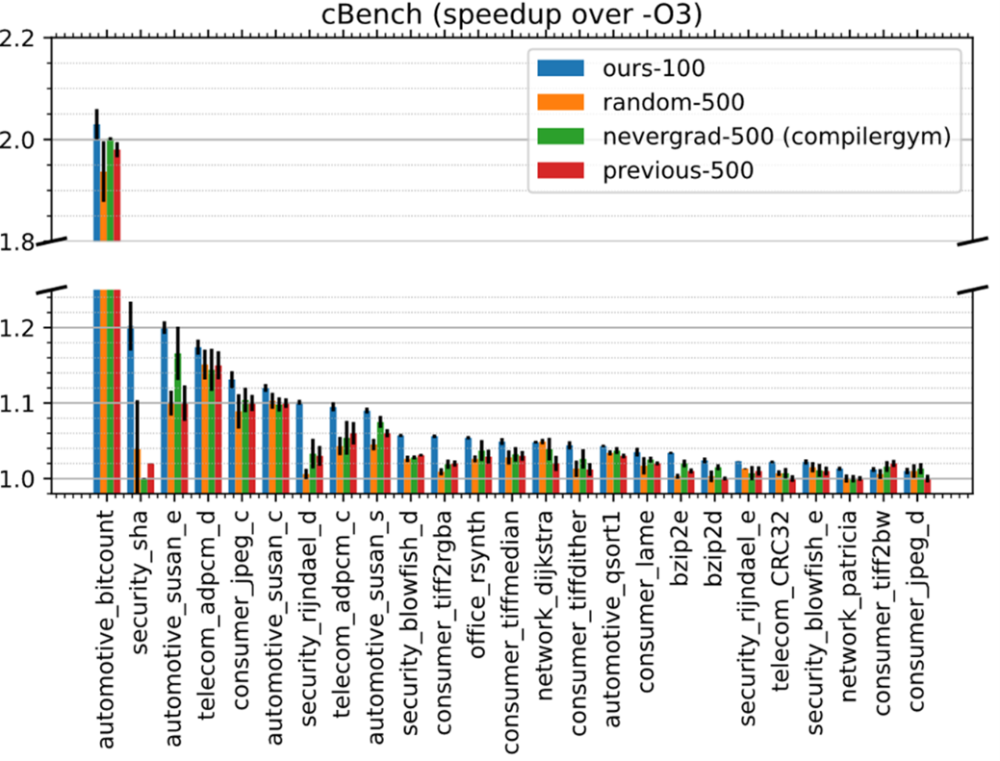

# llvmtuner使用说明


## Installation
以下安装流程在Ubuntu20下测试通过

### 1. 安装llvmtuner
首先安装python环境
>conda create -n llvmtuner python=3.9.9

cd进入主目录，安装llvmtuner：
```
pip install -r requirements.txt
pip install -e .
```
安装后将生成clangopt命令行工具和可导入的llvmtuner库

### 2. 安装LLVM 10.0.0及自定义pass _**ir2count**_
使用提供的自动脚本安装LLVM10.0.0，默认安装目录为~/llvm10.0.0
>./install_llvm.sh

完成后将对应二进制路径添加至环境变量：
>export PATH=~/llvm10.0.0/bin/:$PATH

测试LLVM安装是否成功
>clang --version

安装 _**ir2count**_
```
export LLVM_DIR=~/llvm10.0.0
cd ir2count
mkdir build
cd build
cmake -DLT_LLVM_INSTALL_DIR=$LLVM_DIR ..
make
```

## 快速测试
### 1. 本机在CBench上测试
解压并进入cBench_V1.1目录，执行以下命令为所有benchmarks创建工作目录
>source all__create_work_dirs

进入example文件夹下，执行以下命令来使用我们的贝叶斯优化方法调优特定benchmark，对应结果将保存在~/local_result_llvmtuner/cBench/目录下
>python run_cBench.py --method=BO --budget=100 --benchmark=telecom_adpcm_c


如需观察哪些pass对程序性能影响较大，可使用--pass-reduce选项：
> python run_cBench.py --pass-reduce –opt-params {最优配置文件路径}

### 2. 在cBench上进行交叉编译测试
真实调优场景要求我们使用交叉编译，即编译在多核高性能x86平台，而运行程序在目标平台（如嵌入式开发板）。我们提供了run_cBench_ssh.py在我们的环境下实现了交叉编译调优。请查看example文件夹下的run_cBench_ssh.py示例根据场景构建交叉编译的验证脚本。

我们只需要提供进行交叉编译的命令（用户根据实际场景提供，我们这里展示我们对于cBench的交叉编译的命令），运行及测量方法，即可利用我们的调优框架继续调优。我们提供如下核心代码片段展示如何使用我们框架

```
import llvmtuner
from llvmtuner import searchspace
from llvmtuner.feature_extraction import read_optstats_from_cfgpathlist,read_optstats_from_cfgjsonlist,stats2vec
from llvmtuner.BO.BO import BO
from llvmtuner.function_wrap import Function_wrap

#定义调优函数，其中ccmd为交叉编译命令，ben_dir为执行编译的路径，tmp_dir为结果保存路径，run_and_eval_fun为测量函数，用于运行和测量二进制执行时间
fun = Function_wrap(ccmd, ben_dir, tmp_dir, run_and_eval_fun)

#使用BO进行优化
if args.method=='BO':
    BO=BO(
            fun=fun,
            passes=passes, 
            len_seq=150,
            budget=500, 
            acqf='EI',
            n_init=50,
            )

    BO.minimize()

#使用nevergrad进行优化
elif args.method=='nevergrad':
    import nevergrad as ng
    import numpy as np
    params = ng.p.Choice(
            choices=passes,
            repetitions=len_seq,
            deterministic=True
        )
    optimizer=ng.optimizers.NGOpt(parametrization=params, budget=args.budget)
    for i in range(args.budget):
        x = optimizer.ask()
        seq=list(x.value)
        y=fun(' '.join(seq))
        if y != inf:
            optimizer.tell(x, y)
```

性能测试平台：Jetson-TX2 (4核 Arm cortex-a57, 2.0GHz, 8G LPDDR4, Linux Kernel 4.4.15)

交叉编译及算法运行平台：Intel Xeon Gold 5218R CPU

编译器：LLVM 10.0.1

基准程序集：cBench详见https://ctuning.org/wiki/index.php/CTools:CBench，共有32个benchmark，其中7个在当前版本编译器下存在错误。因此我们最终选取了25个benchmark进行测试。

对比方法：为了体现我们的搜索方法的效率，我们选择了随机搜索、nevergrad框架默认搜索方法和OpenTuner框架默认搜索方法（第一版中我们使用的搜索方法）作为对比。这三种方法给定的搜索预算是500次，分别简写为random-500，nevergrad-500，previous-500。而我们自己的搜索方法只给定100次的搜索预算，简写为ours-100。

结果：实验结果可见下图

我们的算法在仅使用了1/5的搜索预算的情况下仍然取得了超越其他算法的性能。我们的算法在100次搜索后在cBench上取得的几何平均加速比为9.6%，而nevergrad搜索500次仅仅取得6.8%的平均加速比，证实了我们算法的效率。

Pass分析：我们的搜索框架同时还提供了对搜索到的优化序列进行最小化的功能，用于分析到底哪些pass对程序的影响较大。我们统计了不同pass出现在最优序列中的频率，频率超过10%的pass在下表中可见，观察到的趋势是大部分高频pass都与冗余指令削减相关，此外循环优化相关pass也占很大比例。


### 3. 在SPEC CPU 2017上进行交叉编译测试
我们提供了用于在x86平台交叉编译aarch64的配置文件为见my-clang-linux-cross_x862aarch64.cfg。用户安装好SPEC CPU 2017后只需替换run_spec_ssh.py中的测量函数run_and_eval_fun即可，以下为示例：

```
#建议搜索过程中始终保持ssh连接
host="nvidia@TX2-{}.local".format(args.device)
sshC=Connection(host=host)

def run_and_eval_fun():
    _ , binary = args.benchmark.split('.')
    binary = binary + '_base.mytest'
    run_dir = f'/home/nvidia/spec2017_run/{args.benchmark}'
    try:
        ret = sshC.put(local=os.path.join(ben_dir, binary), remote=run_dir)
    except Exception as e:
        assert 1==0

    os.remove(os.path.join(ben_dir, binary))
    
    
    
    myscript = f'run_{args.benchmark}.sh'
    run_cmd = f'time ./{myscript}'
    try:
        with sshC.cd(run_dir):
            ret=sshC.run(run_cmd, hide=True, timeout=100)
        temp=ret.stderr.strip()
        real=temp.split('\n')[-3]
        searchObj = re.search( r'real\s*(.*)m(.*)s.*', real)
        runtime = int(searchObj[1])*60+float(searchObj[2])
    except invoke.exceptions.UnexpectedExit:
        runtime = inf
    except invoke.exceptions.CommandTimedOut:
        runtime = inf
    return runtime 


fun = Function_wrap(ccmd, ben_dir, tmp_dir, run_and_eval_fun)
```
进行测试只需如下命令：
```
# 这里device是指定使用哪一块开发板，用户在提供run_and_eval_fun时可根据实际情况修改
python run_spec_ssh.py --method=BO --budget=100 --benchmark=538.imagick_r --device=1
```
调优结果如下：


## To do
在调优框架部位，后续我们还将提供更进一步的BO方法介绍和更多ablation实验细节。

