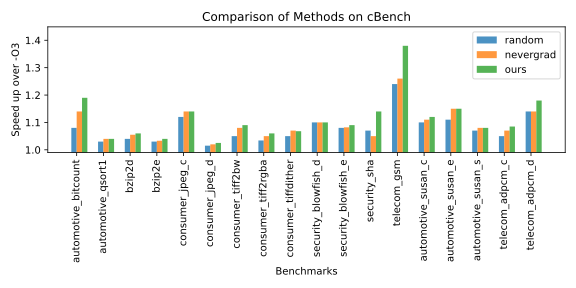
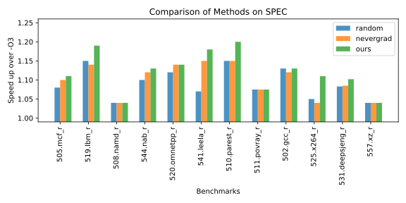
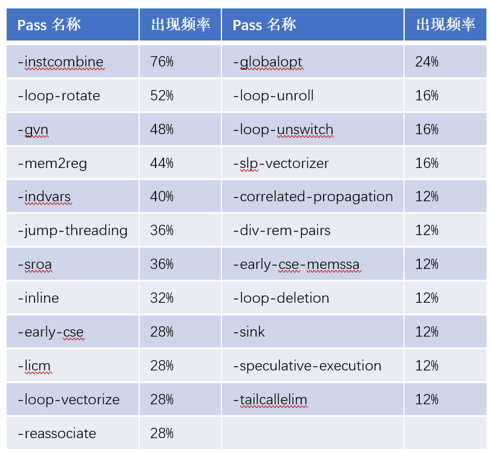

# LLVMTuner User Guide


## Installation
The following installation process has been tested on Ubuntu 20.

### 1. Install LLVMTuner
First, set up a Python environment:
>conda create -n llvmtuner python=3.9.9
>conda activate llvmtuner

Download the source code:
>git clone https://github.com/gloaming2dawn/LLVMTuner.git

Enter the project root directory and install LLVMTuner:
```
pip install -r requirements.txt
pip install -e .
```
After installation, the command-line tools clangopt/clangxxopt and the importable Python module llvmtuner will be available.

### 2. Install LLVM 17.0.6 and the custom pass _**FuncNames**_
Use the provided script to automatically install LLVM 17.0.6. The default installation path is ~/llvm17.0.6
>./install_llvm.sh

Add the LLVM binaries to your PATH：
>export PATH=~/llvm17.0.6/bin/:$PATH

Test whether LLVM is installed
>clang --version

Install _**FuncNames**_
```
export LLVM_DIR=~/llvm17.0.6
cd FuncNames
mkdir build
cd build
cmake -DLT_LLVM_INSTALL_DIR=$LLVM_DIR ..
make
```

### 3. Download FlameGraph
```
git clone https://github.com/brendangregg/FlameGraph.git
```

## Detailed Usage: How to Tune a New Program
### 1. Automatically Detect Hot Files
Real-world programs usually contain many source files. LLVMTuner can automatically detect hot files.
Note: This requires root privileges on the target platform (perf requires root). You must also configure passwordless sudo via: 
> sudo visudo

Add the following to the end of the file (username should be replaced by your real username):
> username ALL=(ALL) NOPASSWD: ALL

Example:
```python
import llvmtuner
from llvmtuner.utils import gen_hotfiles

hotfiles, hotfiles_details = gen_hotfiles(build_cmd, build_dir, tmp_dir, run_cmd, run_dir, binary) # 用户提供 build_cmd, build_dir, run_cmd, run_dir, binary
print(hotfiles,hotfiles_details)
```

### 2. Define the tuning problem as a black-box function
After obtaining hot files, users can define the phase-ordering problem as a black-box function.  Once hot files are provided, the function will compile only these hot files under each new configuration. Since real tuning often requires cross-compilation (compile on x86, run on target platform), users should provide normal build/run commands and directories.

The only requirement is to replace clang/clang++ with clangopt/clangxxopt in the build command, such as:
> `make CC=clangopt`

LLVMtuner also support pass filtering to help analyze which passes matter.

Example:

```python
import llvmtuner
from llvmtuner import searchspace
from llvmtuner.function_wrap import Function_wrap
from llvmtuner.baselines.random import random_optimizer # random,nevergrad,BO
from fabric import Connection

passes = searchspace.default_space()[0]
ssh_connection = Connection(host="xxx.xxx.xxx") #用户提供基于fabric的ssh连接，本地编译并运行则无需提供

fun = Function_wrap(
                    build_cmd=build_cmd, #编译命令，用户提供，注意需将编译器名称由clang/clang++替换为clangopt/clangxxopt
                    build_dir=build_dir, #编译路径，用户提供
                    tmp_dir=tmp_dir, #数据存放目录，用户定义
                    run_cmd=run_cmd, #运行命令，用户提供
                    run_dir=run_dir, #运行路径，用户提供
                    binary=binary, #编译后的二进制文件路径，用户提供
                    ssh_connection=ssh_connection, #ssh连接
                    )
fun.build('default<O3>') # 首先不考虑热点文件在O3下编译，确保非热点文件均在O3下已编译，防止后续编译出错
fun.hotfiles = hotfiles # 然后加入热点文件，此后函数每次接受新的编译配置时，只会编译热点文件

'''
# 假定用户希望自己提供一个自定义的测量函数，而不是使用我们默认提供的测量函数（基于运行命令run_cmd和运行文件夹run_dir，来测量运行时间），可使用以下方式
fun = Function_wrap(build_cmd, #编译命令，用户提供
                    build_dir, #编译路径，用户提供
                    tmp_dir, #数据存放目录，用户定义
                    run_cmd, #运行命令，用户提供
                    run_dir, #运行路径，用户提供
                    hotfiles, #热点文件，用户提供
                    ssh_connection, #ssh连接
                    run_and_eval_fun, #用户提供的测量函数
                    ) #
'''
# cost = fun(config) # 可选，测量某个编译配置的性能，例如config可以为'default<O3>'


optimizer=random_optimizer(fun=fun, passes=passes, budget=1000) # 使用random搜索算法，预算1000次
best_cfg, best_cost = optimizer.minimize() # 自动调优，并获取最优配置及对应运行时间，同时所有中间结果均存放于tmp_dir
fun.build(best_cfg) # 再次使用最优配置编译生成二进制
# fun.reduce_pass(best_cfg) # 可选，使用reduce_pass来筛选出真正对性能有提升的pass
```

## Quick Testing
### 1. Test on cBench (Local Compilation + Execution)
Download and install cBench_V1.1. We have provided a Python script to automatically download and install cBench. The following command will install cBench_V1.1 in the user's home directory.
```
cd example
python download_cbenchdatasets.py
```

Grant execution permissions to cBench
>sudo chmod -R 777 ~/cBench_V1.1

In the example folder, execute the following command to use our Bayesian optimization method for tuning a specific benchmark. The corresponding results will be saved in the ~/local_result_llvmtuner/cBench/ directory.
>python run_cBench.py --method=BO --budget=300 --benchmark=telecom_adpcm_c

Here we provide three optional methods: `random, nevergrad, and BO`.
The benchmark argument can also be replaced with `security_sha, telecom_gsm`, etc.
More available benchmarks for tuning can be found in the run_cBench.py file.


### 2. Cross-compilation testing on cBench
In real tuning scenarios, cross-compilation is typically required—for example, compilation is performed on a multi-core high-performance x86 platform, while the program is executed on the target platform (such as an embedded development board).

We provide `run_cBench_ssh.py`, which implements cross-compilation tuning in our environment.
Users should modify this file according to their own setup. Specifically, the following parts need to be updated (cross-compilation command, run directory, SSH connection, etc.):

```python
cross_flags='--target=aarch64-linux-gnu --sysroot=/home/jiayu/gcc-4.8.5-aarch64/install/aarch64-unknown-linux-gnu/sysroot/ --gcc-toolchain=/home/jiayu/gcc-4.8.5-aarch64/install' #用户应替换为对应平台下的交叉编译工具链
build_dir = os.path.expanduser(f'~/cBench_V1.1/{args.benchmark}/src_work/')
build_cmd = f'make ZCC=clangopt LDCC=clangopt CCC_OPTS="{cross_flags}" LD_OPTS="{cross_flags}" -C {build_dir}'#用户应替换为相应的交叉编译命令

tmp_dir = os.path.join(os.path.expanduser('~/result_llvmtuner_17_test1/cBench/'), args.benchmark, args.method)
binary = os.path.join(build_dir, 'a.out')

ssh_connection=Connection(host=f'nvidia@TX2-{args.device}.local') #用户应替换为相应的ssh连接，支持多次跳转，参阅fabric的API
run_dir = '/home/nvidia/cBench_V1.1/{}/src_work/'.format(args.benchmark) #用户应替换为相应的运行路径
run_cmd = ben2cmd[args.benchmark]
```

### 3. SPEC CPU 2017 Testing
SPEC CPU 2017 is proprietary software. Users must purchase and download it themselves to their home directory, install it following the official guide (https://www.spec.org/cpu2017/Docs/install-guide-unix.html
), and update it to the latest version.

Unlike typical benchmarks, SPEC CPU 2017 provides the `runcpu` command-line tool instead of build scripts.
A platform-specific cfg file must be prepared and placed in the `config/` directory.

We provide an example configuration file `my-clang-linux-x86.cfg` (supporting LLVM, Linux, and x86), located in the example folder, for user's convenient local testing. Copy it into the config directory:

>cp my-clang-linux-x86.cfg ~/cpu2017/config/

We also provide a script for generating run directories and run scripts: `gen_rundir_spec2017.py`.
Running it will generate the `spec2017_run` directory under the home folder. 
>python gen_rundir_spec2017.py

For example, for 519.lbm_r, the run directory will be ~/spec2017_run/519.lbm_r/, and the run script will be run_519.lbm_r.sh.

You can run the following command to automatically tune SPEC CPU 2017 locally:
>python run_SPEC.py --method=random --budget=10 --benchmark=519.lbm_r

For cross-compilation testing of SPEC CPU 2017, users must prepare an appropriate cfg file for their platform.
We provide an example file for cross-compiling AArch64 on an x86 host: `my-clang-linux-cross_x862aarch64.cfg`.
You must also transfer the generated spec2017_run directory to the target platform. 


### 4. Experimental Results
Performance testing platform：Jetson-TX2 (4-core Arm cortex-a57, 2.0GHz, 8G LPDDR4, Linux Kernel 4.4.15)

Cross-compilation and algorithm execution platform: Intel Xeon Gold 5218R CPU

Compiler: LLVM 17.0.6

Benchmark suites：cBench and SPEC CPU 2017

Comparison methods：To demonstrate the efficiency of our search method, we compare against random search and the default search method in the Nevergrad framework. For cBench, both baselines are given a search budget of 1000 evaluations, whereas our method only uses 500 evaluations.
For SPEC CPU 2017, due to its high runtime cost, all methods are limited to 300 evaluations.


The cBench experimental results are shown below.
Even with only half the search budget, our method still outperforms the baselines.



The SPEC experimental results are shown below.
Our method again achieves the best overall performance.



Pass analysis：Our search framework also provides a reduction step that minimizes the discovered optimization sequence to identify which passes truly impact performance.
We computed the frequency of each pass appearing in the optimal sequences across cBench.
The passes whose frequency exceeds 10% are shown in the following figure.
Most frequently appearing passes are related to redundant instruction elimination, with loop optimization passes also contributing significantly.




